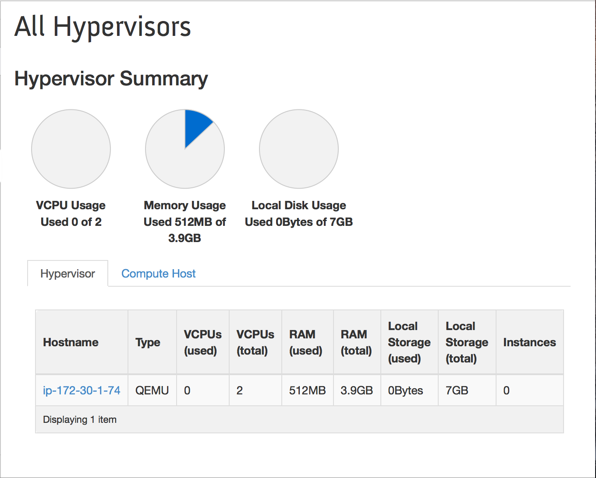
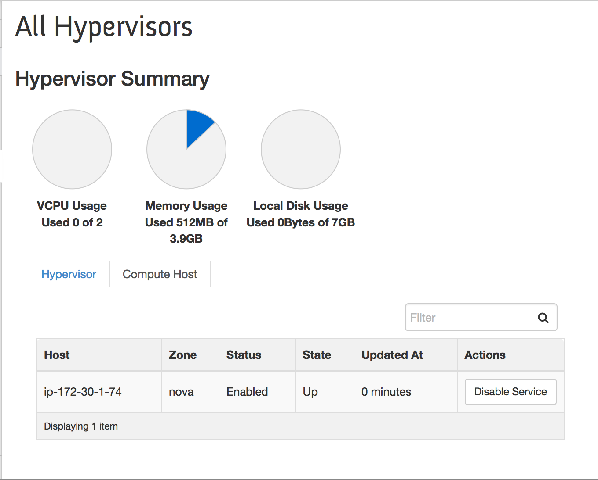

## Lab 1

Notes for implementation:
* aws vm's need to in a security group that allows a crap-ton of ports, opening all of them for now 
* devstack install fails on t2.micro ubuntu. :( t2.medium worked
* devstack install takes about 15 minutes, might want to ansibalize that? 
* Anytime ./stack.sh fails we should document the error and solution in [common errors](common-errors.md), most of my time spent on this lab was mis-configuring local.conf and seeing what errors show up
* is the time waiting for devstack to install useful for students or should we do it for them?  

### Connect to your instance:
  0. `chmod 400 student-key-###.pem`
  0. `ssh ubuntu@W.X.Y.Z -i student-key-###.pem`
  0. `sudo whoami`

### Install DevStack:
  0. `sudo apt-get install git`
  0. `git clone https://git.openstack.org/openstack-dev/devstack`
  0. `cd devstack`
  0. `cp samples/local.conf local.conf`
  0. `ip addr show dev eth0` and record your instance's internal IP address 
  
    |Instance Internal IP Address|
    |----------------------------|
    |            &nbsp;          |
    
  0. `nano local.conf` or `vim local.conf`
      
      Edit the 'local.conf` file, it should look like [example-local.conf](example-local.conf) 

  0. Run stack.sh, this will take awhile, see [common errors](common-errors.md) if anything fails.
    
    `./stack.sh 2>&1 | tee stack.log`

    > :white_check_mark: **Additional Info**:
    >
    > * `stack.sh` is a very long, but well documented script.  Check it out [here](http://docs.openstack.org/developer/devstack/stack.sh.html).
    >
    > *  In order to capture the printed results of `stack.sh` we pipe it to a file
    >   * `2>&1` pipes stderr to stdout (allowing us to capture both)
    >   * `|` is a pipe, it sends values to the next command
    >   * `tee` is splits a pipe (like a "T) it sends printed results to a file `stack.log` in addition to printing to the screen

  0. Login to the OpenStack Horizon Web Interface by pointing your browser at the public IP address of your instance, explore the accessible pages and fill in the table of information

    
    
    
    
    

    
